# LearnHub — Online Course Management System

LearnHub is a full-stack web app for managing online courses and student enrollments.

- **Admins** create and publish courses, organise lessons, manage users and monitor enrollments.
- **Students** browse the catalog, enroll in courses and track their progress lesson by lesson.

| Deliverable | Link |
| --- | --- |
| Live demo | _add your Vercel URL here_ |
| GitHub repository | _add your repository URL here_ |
| REST API documentation | [docs/API.md](docs/API.md) |
| Database schema | [docs/DATABASE.md](docs/DATABASE.md) · [drizzle/0000_init.sql](drizzle/0000_init.sql) |
| Screenshots | [Screenshots section below](#screenshots) · [docs/screenshots](docs/screenshots) |
| Architecture diagram | [.archify/architecture-learnhub-20261004-212803/learnhub.html](.archify/architecture-learnhub-20261004-212803/learnhub.html) (download and open in a browser) |

## Screenshots

Taken from the running app (production build) against a seeded Neon database.

### Public site

| Landing page | Course catalog (search and filters) |
| --- | --- |
| 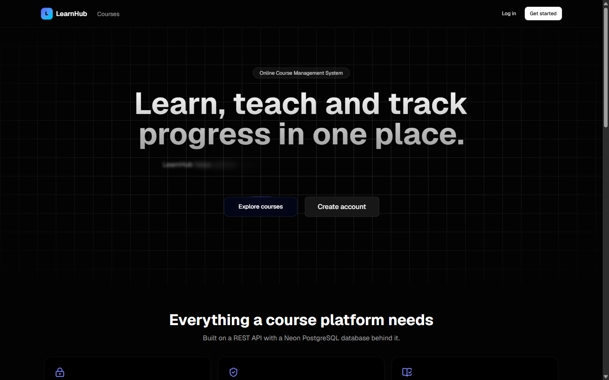 | 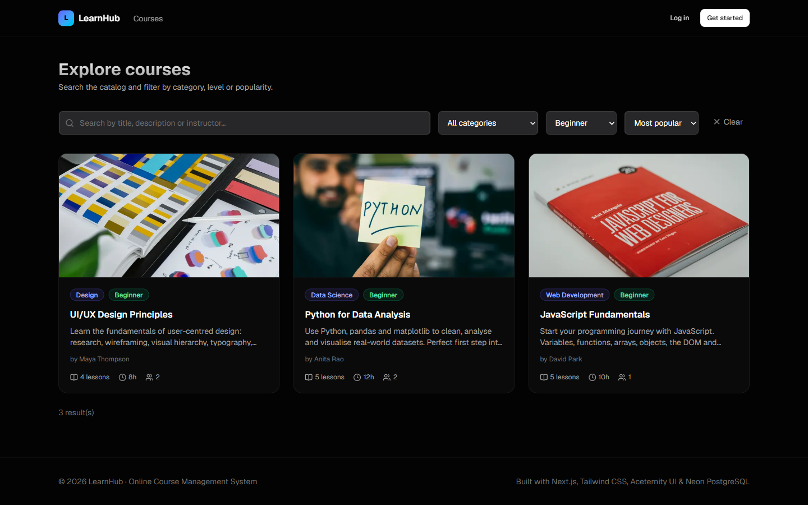 |

| Course detail | Login with demo accounts |
| --- | --- |
| 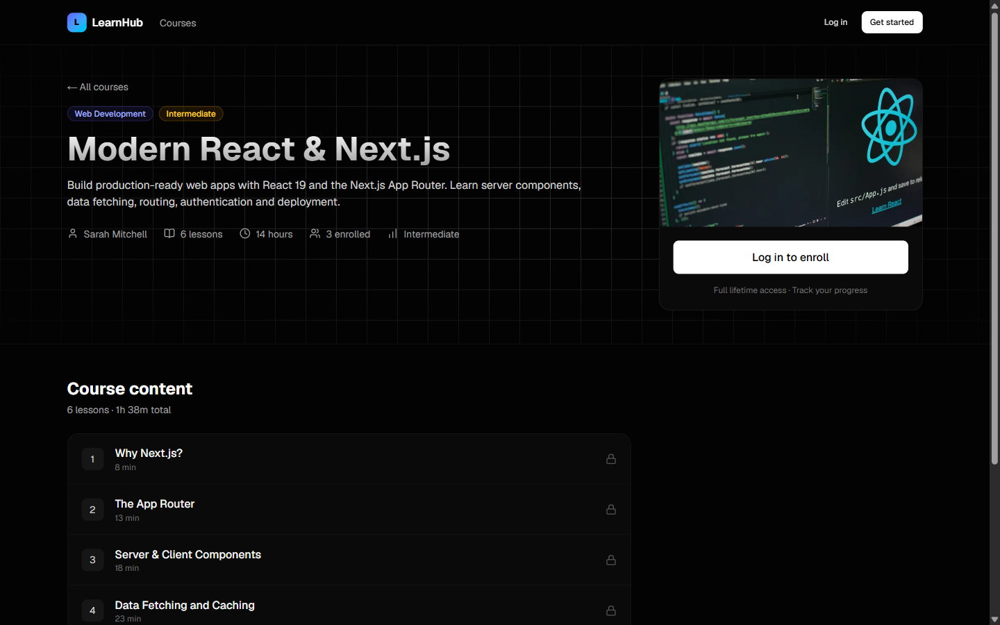 | 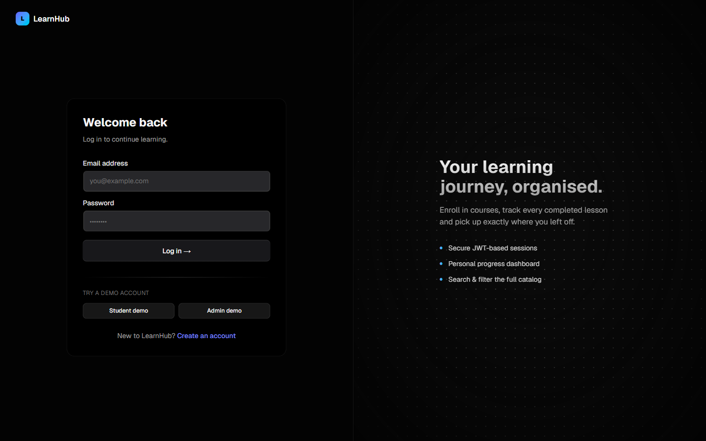 |

| Sign-up form validation |
| --- |
| 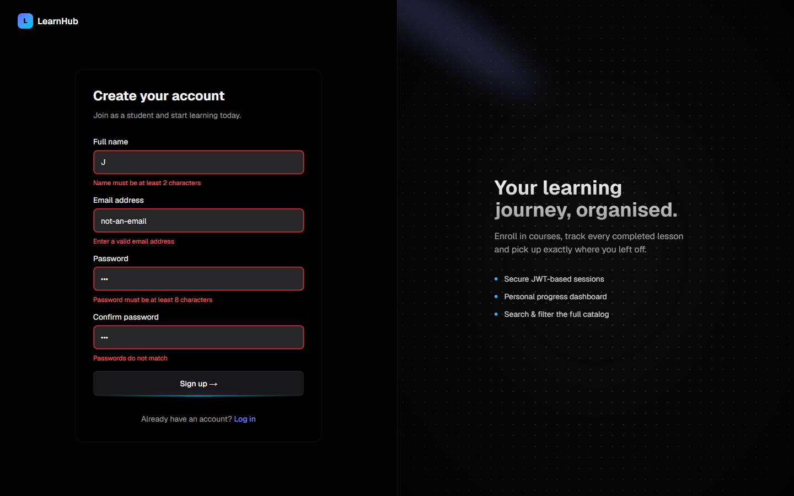 |

The [full landing page](docs/screenshots/02-landing-full.png) is also available as one tall image.

### Student

| Dashboard | My courses |
| --- | --- |
| 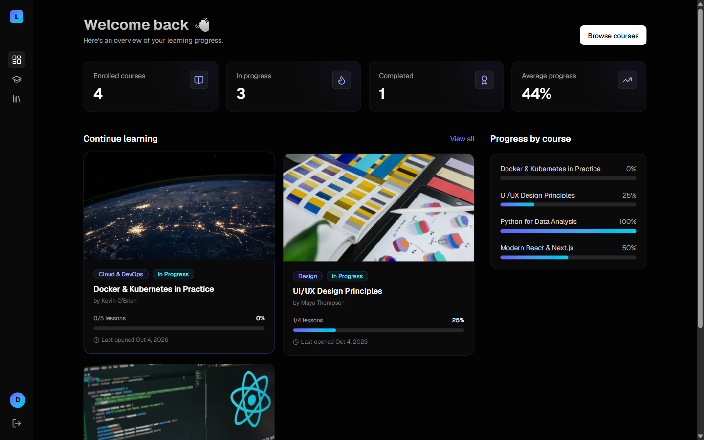 | 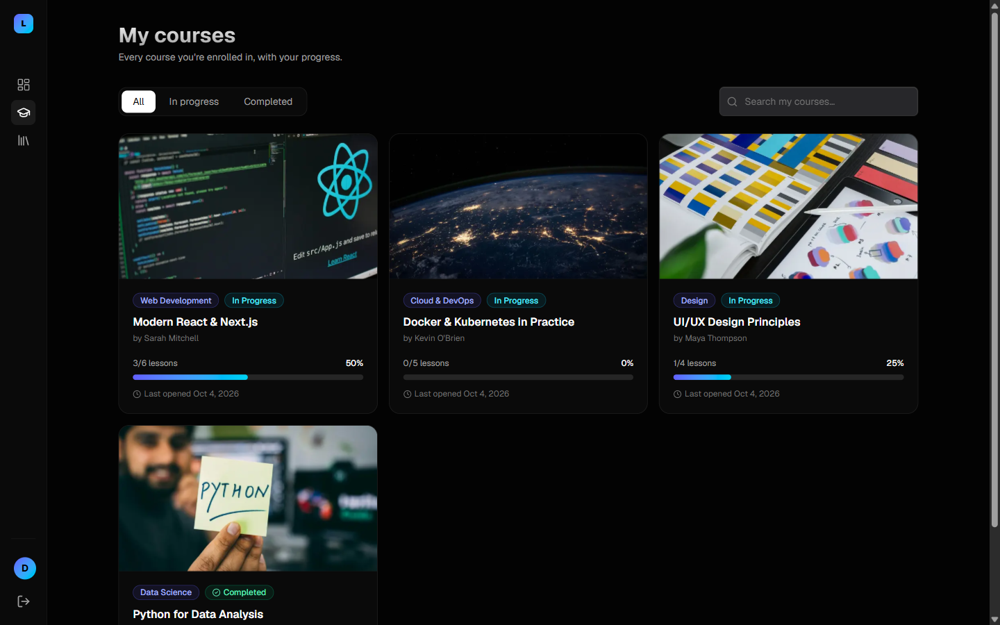 |

| Lesson player with progress tracking |
| --- |
| 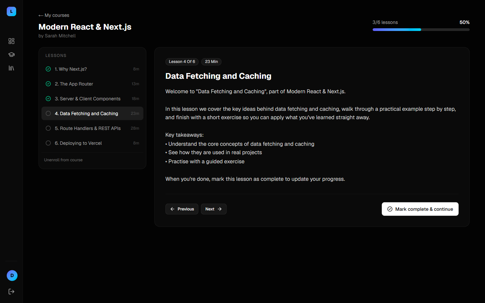 |

### Admin

| Overview and analytics | Course management |
| --- | --- |
| 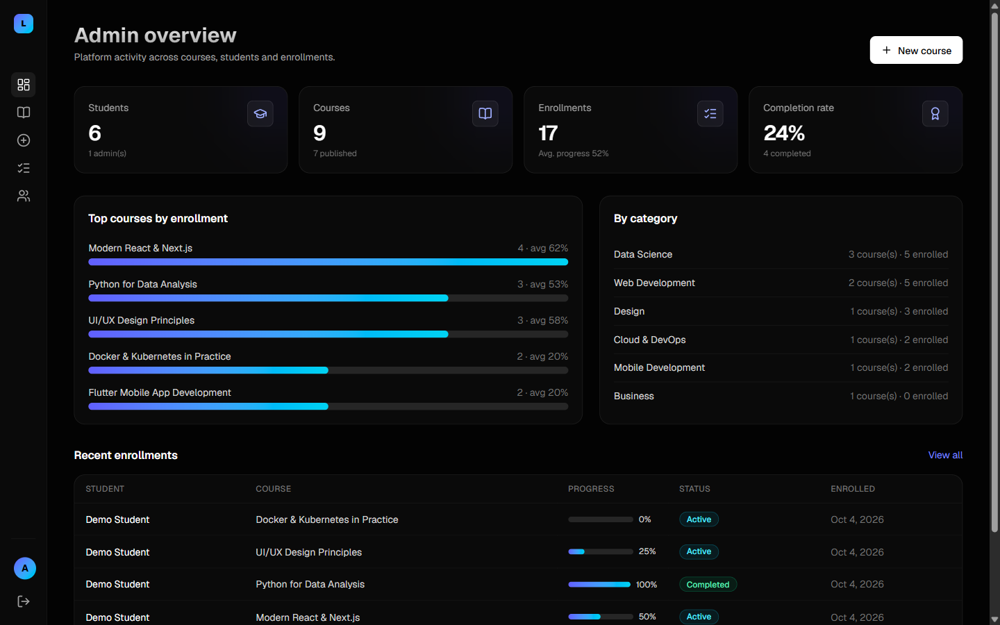 | 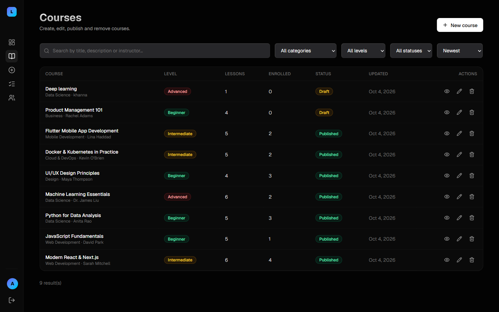 |

| Course form validation | Enrollments (searched) |
| --- | --- |
| 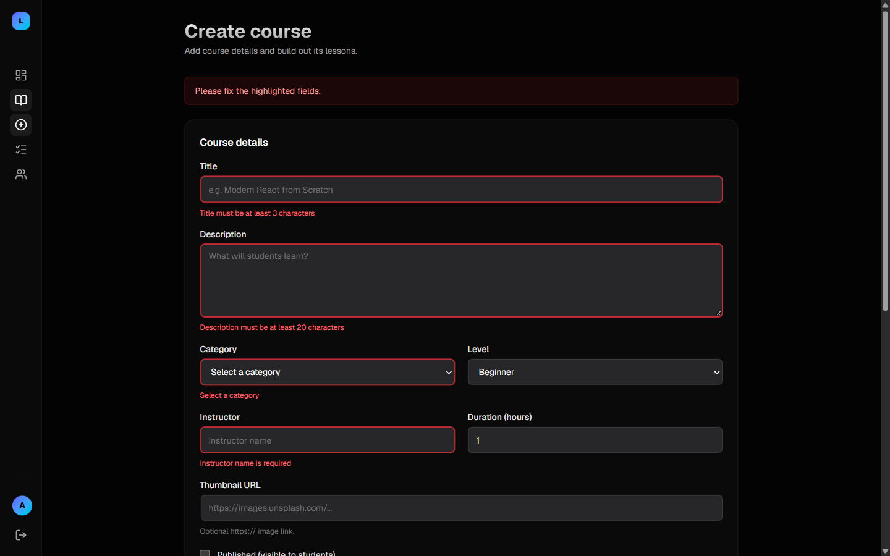 | 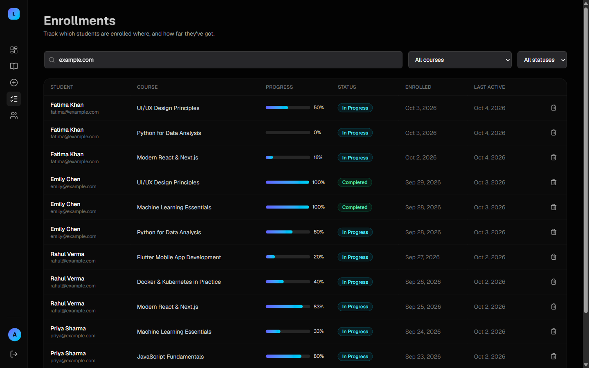 |

| Users (searched) |
| --- |
| 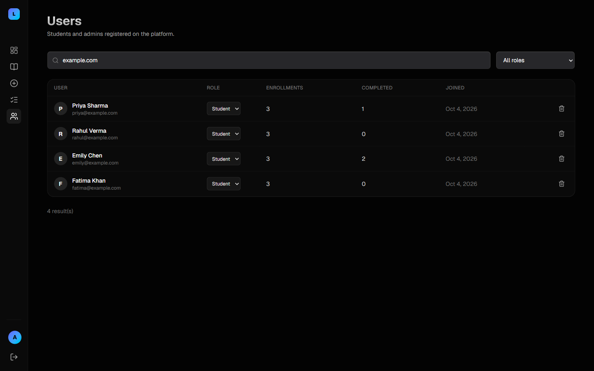 |

### Mobile

| Student dashboard | Navigation drawer |
| --- | --- |
| 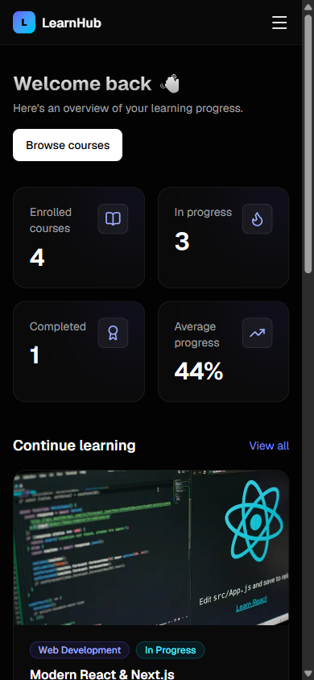 | 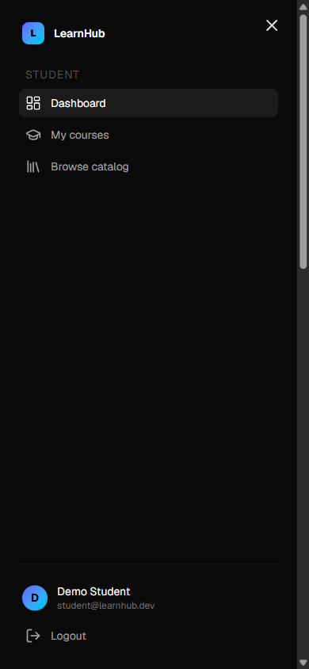 |

## Tech stack

| Layer | Technology |
| --- | --- |
| Framework | **Next.js 16** (App Router, Route Handlers, Proxy), React 19, TypeScript |
| Styling | **Tailwind CSS v4** |
| UI components | **Aceternity UI** patterns (Spotlight, Sidebar, Card Hover Effect, Bento Grid, Moving Border, Text Generate Effect, animated inputs) built with `motion` |
| Auth | **JWT** (`jose`, HS256) in an httpOnly cookie or a `Bearer` header; passwords hashed with `bcryptjs` |
| Database | **Neon PostgreSQL** (serverless) with **Drizzle ORM** and migrations |
| Validation | **Zod**, with the same schemas used on the client and the server |
| Deployment | Vercel + Neon |

## Features

1. **Authentication and authorization.** Users can register, log in and log out. JWT sessions use two roles, `student` and `admin`.
   - `src/proxy.ts` redirects pages based on role.
   - Server layouts and every API handler re-verify the token.
2. **REST APIs** for auth, courses, lessons, enrollments, progress, users and admin stats, with a consistent JSON envelope and status codes.
3. **Dashboards**
   - Student: stats, "continue learning", progress by course, my courses and a lesson player.
   - Admin: KPIs, top courses, a category breakdown, recent enrollments, plus course, enrollment and user management.
4. **Database**: normalised Postgres schema with foreign keys, cascades, unique constraints and indexes.
5. **Search, filtering and progress tracking**
   - Keyword search, category, level, status and sort filters, with pagination. Catalog filters are kept in the URL.
   - Progress is tracked per lesson and recalculated on the server.
6. **Responsive design and validation**
   - Mobile drawer sidebar and responsive grids and tables.
   - Inline, accessible form errors: client-side Zod checks first, then server-side errors are mapped back to the matching fields.
7. **Deployment-ready**: lazy DB client, env-based secrets, production build passes.

## Project structure

```
src/
├─ app/
│  ├─ (public)/            # Landing page, course catalog, course detail (with navbar/footer)
│  ├─ (auth)/              # Login & register
│  ├─ student/             # Student dashboard, my courses, lesson player
│  ├─ admin/               # Admin overview, courses CRUD, enrollments, users
│  └─ api/                 # REST API route handlers
├─ components/
│  ├─ ui/                  # Aceternity-style UI primitives
│  └─ *.tsx                # Feature components (forms, cards, shell)
├─ db/                     # Drizzle schema + Neon client
├─ lib/                    # JWT, API helpers, validation schemas, client fetcher, hooks
├─ server/                 # Data-access/services used by API routes and server components
└─ proxy.ts                # Route protection (Next.js 16 "proxy", formerly middleware)
drizzle/                   # SQL migrations
scripts/seed.ts            # Demo data
docs/                      # API docs, DB schema, screenshots
```

## Getting started

### 1. Prerequisites
- Node.js 20.9+ (Next.js 16 requirement)
- A free [Neon](https://neon.tech) Postgres database

### 2. Install

```bash
npm install
```

### 3. Configure environment

Copy `.env.example` to `.env` and fill in:

```env
DATABASE_URL="postgresql://...neon.tech/neondb?sslmode=require"
JWT_SECRET="at-least-32-random-characters"
JWT_EXPIRES_IN="7d"
```

To generate a secret, run:

```bash
node -e "console.log(require('crypto').randomBytes(48).toString('base64url'))"
```

### 4. Create tables and seed demo data

```bash
npm run db:migrate
```

```bash
npm run db:seed
```

### 5. Run

```bash
npm run dev
```

Open http://localhost:3000.

### Demo accounts (after seeding)

| Role | Email | Password |
| --- | --- | --- |
| Admin | `admin@learnhub.dev` | `Admin@123` |
| Student | `student@learnhub.dev` | `Student@123` |

The login page also has one-click buttons that fill in these demo credentials.

## Scripts

| Script | Description |
| --- | --- |
| `npm run dev` | Start the dev server |
| `npm run build` / `npm start` | Production build and serve |
| `npm run lint` | ESLint |
| `npm run db:generate` | Generate a migration from `src/db/schema.ts` |
| `npm run db:migrate` | Apply migrations |
| `npm run db:push` | Push the schema directly (prototyping) |
| `npm run db:seed` | Reset and seed demo data |
| `npm run db:studio` | Open Drizzle Studio |

## Deployment (Vercel + Neon)

1. Push this repository to GitHub.
2. In Vercel, choose **Add New → Project** and import the repo. The framework is auto-detected as Next.js.
3. Add the `DATABASE_URL`, `JWT_SECRET` and `JWT_EXPIRES_IN` environment variables.
4. Deploy. Migrations and the seed are run once from your machine against the same Neon database (`npm run db:migrate && npm run db:seed`).

## Security notes

- Passwords are hashed with bcrypt (cost 10). Login compares against a dummy hash for unknown emails so response times stay uniform.
- JWTs are stored in `httpOnly`, `SameSite=Lax` cookies, and marked `Secure` in production.
- Every API route checks the role on the server. Students can only read or modify their own enrollments; other students' enrollments return 404.
- Public sign-up can only create students. Admins cannot demote or delete themselves.
- All input is validated with Zod. Route ids are checked to be UUIDs. Search terms are escaped before they are used in `ILIKE` patterns.
