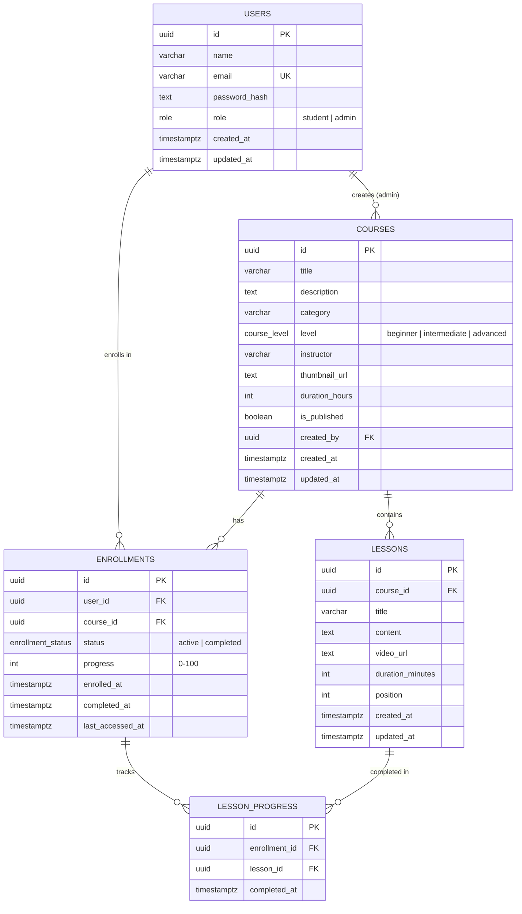

# Database Schema

The app stores its data in **Neon serverless PostgreSQL** and uses **Drizzle ORM** to access it.

- Schema source: [`src/db/schema.ts`](../src/db/schema.ts)
- Generated SQL migration: [`drizzle/0000_init.sql`](../drizzle/0000_init.sql)

## Entity relationship diagram



## Enums

| Enum | Values |
| --- | --- |
| `role` | `student`, `admin` |
| `course_level` | `beginner`, `intermediate`, `advanced` |
| `enrollment_status` | `active`, `completed` |

## Tables

### `users`
| Column | Type | Constraints |
| --- | --- | --- |
| id | uuid | PK, default `gen_random_uuid()` |
| name | varchar(100) | not null |
| email | varchar(255) | not null, **unique** (`users_email_idx`) |
| password_hash | text | bcrypt hash, never returned by the API |
| role | role | not null, default `student`, indexed |
| created_at / updated_at | timestamptz | default `now()` |

### `courses`
| Column | Type | Constraints |
| --- | --- | --- |
| id | uuid | PK |
| title | varchar(150) | not null |
| description | text | not null |
| category | varchar(60) | not null, indexed |
| level | course_level | default `beginner`, indexed |
| instructor | varchar(100) | not null |
| thumbnail_url | text | nullable |
| duration_hours | integer | default 1 |
| is_published | boolean | default `false`, indexed |
| created_by | uuid | FK → `users.id`, **ON DELETE SET NULL** |
| created_at / updated_at | timestamptz | |

### `lessons`
| Column | Type | Constraints |
| --- | --- | --- |
| id | uuid | PK |
| course_id | uuid | FK → `courses.id`, **ON DELETE CASCADE** |
| title | varchar(150) | not null |
| content | text | not null |
| video_url | text | nullable |
| duration_minutes | integer | default 10 |
| position | integer | 0-based order within the course; composite index `(course_id, position)` |

### `enrollments`
| Column | Type | Constraints |
| --- | --- | --- |
| id | uuid | PK |
| user_id | uuid | FK → `users.id`, **ON DELETE CASCADE** |
| course_id | uuid | FK → `courses.id`, **ON DELETE CASCADE**, indexed |
| status | enrollment_status | default `active` |
| progress | integer | 0–100, derived from `lesson_progress` |
| enrolled_at | timestamptz | default `now()` |
| completed_at | timestamptz | set when progress reaches 100 |
| last_accessed_at | timestamptz | updated each time the student opens the course |

**Unique** `(user_id, course_id)`: a student can only enroll in a course once.

### `lesson_progress`
| Column | Type | Constraints |
| --- | --- | --- |
| id | uuid | PK |
| enrollment_id | uuid | FK → `enrollments.id`, **ON DELETE CASCADE** |
| lesson_id | uuid | FK → `lessons.id`, **ON DELETE CASCADE** |
| completed_at | timestamptz | default `now()` |

**Unique** `(enrollment_id, lesson_id)`: a lesson can only be completed once per enrollment.

## How progress is tracked

1. Marking a lesson complete inserts a row into `lesson_progress`. Marking it incomplete deletes that row.
2. `recalculateProgress()` ([`src/server/progress.ts`](../src/server/progress.ts)) runs a single `UPDATE … FROM` statement that sets
   `progress = completed_lessons * 100 / total_lessons`, `status = 'completed'` at 100%, and stamps `completed_at`.
3. The same recalculation runs for a whole course whenever an admin adds or removes lessons, so stored percentages stay accurate.

## Commands

```bash
npm run db:generate   # regenerate SQL migrations after editing src/db/schema.ts
npm run db:migrate    # apply migrations in ./drizzle to DATABASE_URL
npm run db:seed       # wipe and load demo data
npm run db:studio     # browse data in Drizzle Studio
```
